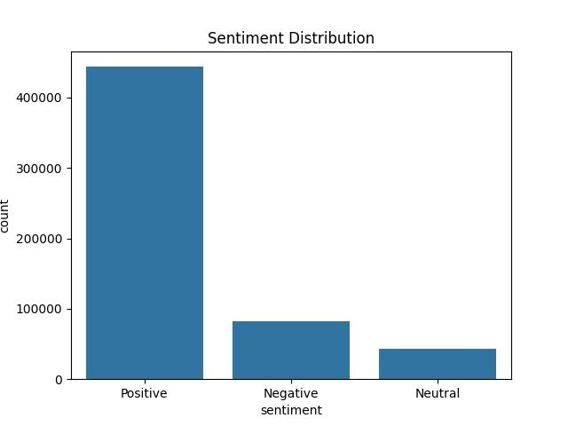
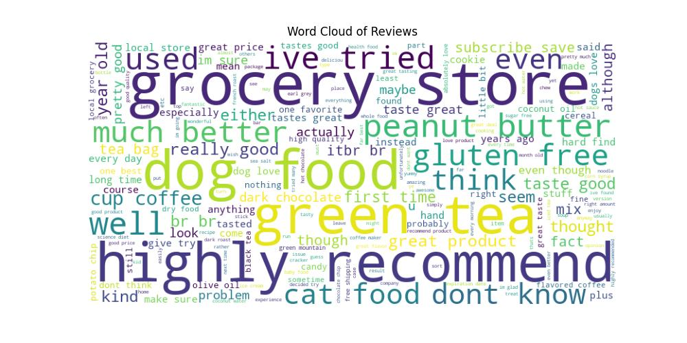

# 📊 Customer Sentiment & Review Intelligence

## 📌 Overview

This project analyzes customer reviews from the Amazon Fine Food Reviews dataset to extract sentiment insights and build a machine learning model for sentiment classification.

---

## 🎯 Objectives

* Analyze customer sentiment from textual reviews
* Identify key drivers of positive and negative feedback
* Build and evaluate a sentiment classification model
* Generate actionable business insights

---

## 🛠️ Tech Stack

* Python
* Pandas, NumPy
* Matplotlib, Seaborn
* Scikit-learn (TF-IDF, Logistic Regression)

---

## ⚙️ Methodology

1. **Data Preprocessing**

   * Cleaned review text (lowercasing, removing noise)
   * Handled missing values

2. **Feature Engineering**

   * Converted text into numerical features using TF-IDF
   * Used unigrams + bigrams for better context capture

3. **Modeling**

   * Trained Logistic Regression model
   * Applied class balancing to handle imbalanced data

4. **Evaluation**

   * Compared with Naive Bayes model
   * Selected best model based on recall and F1-score

---

## 📊 Model Performance

* Accuracy: ~79%
* Strong performance across all sentiment classes
* Significant improvement in detecting neutral and negative reviews after class balancing

## 🔍 Model Comparison

| Model               | Accuracy| Key Observation |
|---------------------|---------|-----------------------------------------|
| Logistic Regression |  ~79%   | Balanced performance across all classes |
| Naive Bayes         |  ~83%   | Poor performance on Neutral/Negative    |


👉 Logistic Regression was selected due to better real-world reliability.

## 📈 Visualizations

### Sentiment Distribution


---

### Word Cloud


---

## 🔍 Key Insights

- Majority of reviews are positive → strong product satisfaction  
- Negative reviews highlight quality and consistency issues  
- Balanced model improves detection of customer dissatisfaction  
- Helps businesses identify actionable improvement areas 

---

## 🚀 How to Run

```bash
pip install -r requirements.txt
python main.py
```
---

## 📥 Dataset

Dataset not included due to size.
Download from: https://www.kaggle.com/datasets/snap/amazon-fine-food-reviews

---

🔮 Future Improvements
-Deploy as a Streamlit dashboard
-Use advanced NLP models (BERT)
-Real-time sentiment monitoring pipeline

---

## 💼 Business Impact

This project demonstrates how NLP and machine learning can be used to transform unstructured customer feedback into actionable insights, helping businesses improve product quality and customer experience.
